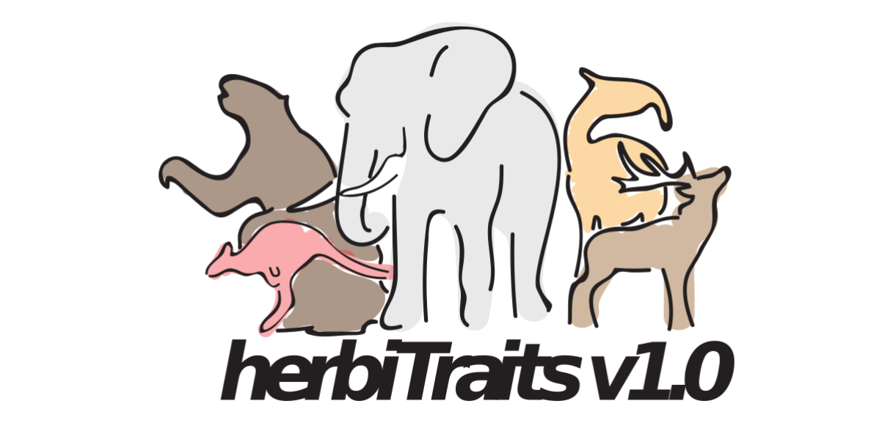

```{r load_herbitraits, include = FALSE }
## Clear Working Memory
rm(list = ls())

## Check Working Directory
getwd()

## Load Data
herbitraits.data = read.csv("./data/Version_1/HerbiTraits_V1/HerbiTraits_Data_v1.csv")
herbitraits.references = read.csv("./data/Version_1/HerbiTraits_V1/HerbiTraits_References_v1.csv")

```



# Introduction

HerbiTraits is a functional trait dataset that contains functional traits of all large-bodied (≥10 kg), terrestrial, avian and mammalian herbivores that lived during the last 130,000 years (n = `r nrow(herbitraits.data)` species).
The mammalian component of the dataset is based on PHYLACINE V1.2 taxonomy and root traits, but we have provided more detailed trait information for the species of interest.
The avian component has been added by the authors of HerbiTraits.
HerbiTraits includes data on:

-   Body Mass
-   Diet
-   Fermentation Type
-   Habitat Use
-   Limb Morphology

Each of these traits is fundamental to the ecological impact that large herbivores have on terrestrial ecosystems.
Trait data were compiled from `r nrow(herbitraits.references)` sources and represent the best available knowledge on the functional traits of late Quaternary herbivorous mammals.
As such, HerbiTraits provides a tool for the analysis of herbivore functional diversity both past and present, as well as their effects on ecosystem dynamics.
<br>

# Downloading the data

The HerbiTraits dataset is hosted on [Figshare](https://www.youtube.com/watch?v=dQw4w9WgXcQ) as well as [Github](https://github.com/MegaPast2Future/HerbiTraits).
Note that the updated versions of this dataset will only be available on the Github page.
<br>

# Using the data

HerbiTraits consists of three csv files containing the trait dataset, metadata, and references.
They are also available as an excel file which contains the three previously mentioned files as sheets.
The dataset is open-access.
For detailed information on the metadata, please see the [original publication](https://www.youtube.com/watch?v=dQw4w9WgXcQ) in *Scientific Data* and the metadata file.
<br>

In addition to the HerbiTraits trait dataset, this repo contains a folder with "incomplete traits".
These are traits that the authors have collected for some species, but not all.
We have included them here so they can serve as a basis for further analysis.
However, they should be considered "work in progress" and they may change in future updates.
Just like the herbitraits base file, we have provided three separate csv files with metadata, trait data and references and an excel file which combines these csv files.
<br>

# Citing the data

When using these data, please cite:

*Lundgren, E. J., Schowanek, S. D., Rowan, J., Middleton, O., Pedersen, R. Ø., Wallach, A. D., ... & Svenning, J. C. (2021). Functional traits of the world's late Quaternary large-bodied avian and mammalian herbivores. Scientific Data, 8(1), 1-21.*

Please also cite the underlying data sources where relevant.
<br>

# Updates

We aim to maintain HerbiTraits with the best available data and to incorporate other ecologically relevant traits in the future.
We urge users to report errors or updates on newly published data, to use for correction or integration into HerbiTraits.
You can send us your corrections by filling in [the following form](https://forms.gle/6WBK6GkrkPit9x9Y6).

Before using HerbiTraits please also check our Issues page.
We use it to report errors found in the dataset that have not yet been changed in the public version of the dataset.
These errors will be corrected in the next version of HerbiTraits.

<br> <br> <br> <br>

------------------------------------------------------------------------

<p>

HerbiTraits is a collaboration between Aarhus University, the University of Technology, Sydney, Sussex University and the University at Albany.
If you want to get into contact with us, please contact Erick J. Lundgren ([erick.lundgren\@gmail.com](mailto:erick.lundgren@gmail.com){.email}) or Simon D. Schowanek ([simondschowanek\@gmail.com](mailto:simondschowanek@gmail.com){.email}).

</p>
