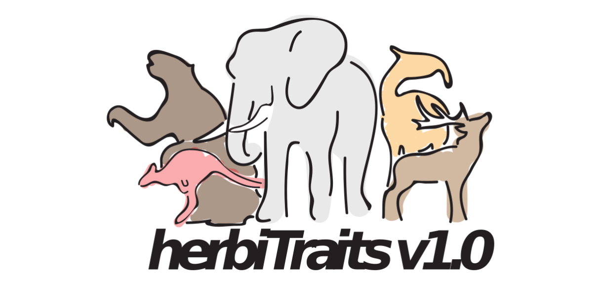

READ ME FOR THE HERBITRAITS TRAIT DATASET
================
2020/11/25

# Introduction

HerbiTraits is a functional trait dataset that contains functional
traits of all large-bodied (≥10 kg), terrestrial, avian and mammalian
herbivores that lived during the last 130,000 years (n = 545 species).
The mammalian component of the dataset is based on PHYLACINE V1.2
taxonomy and root traits, but we have provided more detailed trait
information for the species of interest. The avian component has been
added by the authors of HerbiTraits. HerbiTraits includes data on:

  - Body Mass
  - Diet
  - Fermentation Type
  - Habitat Use
  - Limb Morphology

Each of these traits is fundamental to the ecological impact that large
herbivores have on terrestrial ecosystems. Trait data were compiled from
557 sources and represent the best available knowledge on the functional
traits of late Quaternary herbivorous mammals. As such, HerbiTraits
provides a tool for the analysis of herbivore functional diversity both
past and present, as well as their effects on ecosystem dynamics.  

# Downloading the data

The HerbiTraits dataset is hosted on
[Figshare](https://www.youtube.com/watch?v=dQw4w9WgXcQ) as well as
[Github](https://github.com/MegaPast2Future/HerbiTraits). Note that the
updated versions of this dataset will only be available on the Github
page.  

# Using the data

HerbiTraits consists of three csv files containing metadata, the trait
dataset, and references. They are also available as an excel file which
contains the three previously mentioned files. The dataset is
open-access.For detailed information on the metadata, please see the
[original publication](https://www.youtube.com/watch?v=dQw4w9WgXcQ) in
*Scientific Data* and the metadata file.  

In addition to the HerbiTraits trait dataset, this repo contains a
folder with “incomplete traits”. These are traits that the authors have
collected for some species, but not all. We have included them here so
they can serve as a basis for further analysis. However, they should be
considered “work in progress” and they may change in future updates.
Just like the herbitraits base file, we have provided three separate csv
files with metadata, trait data and references and an excel file which
combines these csv files.  

# Navigating the Repository

This repository contains:

  - A README file
  - The original HerbiTraits publication (will be added upon
    publication)
  - A Data folder
  - A Scripts Folder
  - An R project

 

The **Data** folder contains all the HerbiTraits data and is the part
most users will be interested in. It contains various subfolders
denoting the different versions of the dataset. The folder names
*Version\_1* contains HerbiTraits Version 1, the dataset that
accompanied the orginal publication. The other folders contain more
recent, updated versions of the dataset and are named based on their
version number (e.g. *version\_2*, *Version\_3* etc.). The higher the
number the more recent the dataset. The folder named *Version\_Dev*
contains the version of HerbiTraits that is currently under development.
Once enough changes to the dataset have been made, the *Version\_Dev*
folder will be published as the latest release.

The **Scripts** folder contains the scripts to update and expand the
HerbiTraits dataset. Like the “Data” folder, it contains subfolders that
are organised and named based on the different versions. The latest
changes to the dataset are contained in the folder called
*Version\_Dev*. Once a new version of the HerbiTraits Dataset is
published, this “Version\_Dev” folder will be stored under the latest
version name, and a new Version\_Dev will be created.

The scripts folder and the R project are primarily meant to aid people
who work on HerbiTraits. They likely will not be important for most
users.  

# Citing the data

When using these data, please cite:

*Lundgren, E.J., Schowanek, S.D., Middleton, O., Davis, M., Ramp,
D.,Pedersen, R.Ø., Sandom, C.J., Svenning,J-C.,Wallach,A.D., & Rowan, J.
(2020). Functional traits of the world’s late Quaternary large-bodied
avian and mammalian herbivores. (In Review, Nature Scientific Data).*

Please also cite the underlying data sources where relevant.  

# Updates

We aim to maintain HerbiTraits with the best available data and to
incorporate other ecologically relevant traits in the future. We urge
users to report errors or updates on newly published data, to use for
correction or integration into HerbiTraits. You can send us your
corrections by filling in [the following
form](https://forms.gle/6WBK6GkrkPit9x9Y6).        

-----

HerbiTraits is a collaboration between Aarhus University, the University
of Technology, Sydney, Sussex University and the University at Albany.
If you want to get into contact with us, please contact Erick J.
Lundgren (<erick.lundgren@gmail.com>) or Simon D. Schowanek
(<simondschowanek@gmail.com>).

